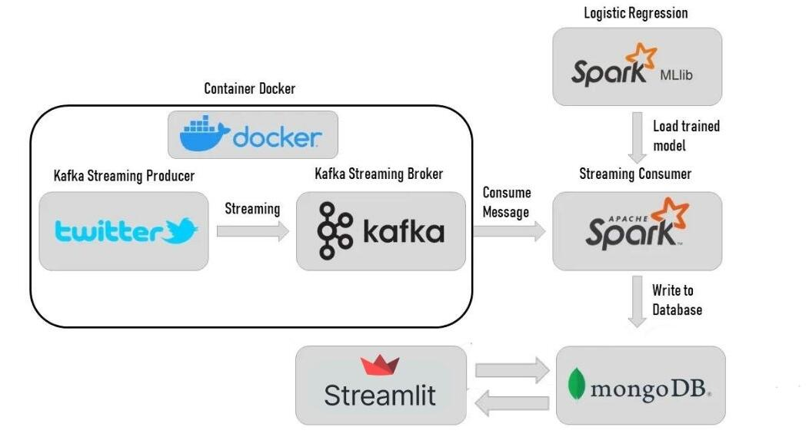

# Twitter Sentiment Analysis

This project analyzes real-time Twitter data to determine sentiment (positive, negative, neutral) using Apache Kafka, Spark, and a pre-trained logistic regression model. The results are stored in a MongoDB database and visualized using a Streamlit web application.

#### This diagram illustrates the project's architecture:


## Project Structure

```markdown
.
├── Consumer
│   ├── Consumer.py
│   ├── Pretrained_LogisticRegression.pkl
│   └── requirements.txt
├── Producer
│   ├── Dockerfile
│   ├── Producer.py
│   ├── requirements.txt
│   └── twitter_validation.csv
└── WebApp
    ├── __pycache__
    ├── fonts
    ├── images
    ├── MongoDB.py
    ├── TestSentiment.py
    ├── Visualisation.py
    ├── VisualisationTest.py
    ├── main.py
    └── requirements.txt

```


**Important Note:** The `Producer.py` script and the `twitter_validation.csv` file are located within the `kafka1` Docker container and are accessed using Docker volumes. 

## Getting Started

### Prerequisites

* **Docker:** [https://www.docker.com/](https://www.docker.com/)
* **Python 3.9:** [https://www.python.org/](https://www.python.org/)
* **Git:** [https://git-scm.com/](https://git-scm.com/)

### Installation

1. **Clone the Repository:**
  
  git clone https://github.com/HAFDAOUIH/Twitter_Sentiment_Analysis.git
  cd Twitter_Sentiment_Analysis
  
  #### Install Python Dependencies:
  ```bash
  pip install -r requirements.txt
  ```
  
  #### Set Up Kafka and Zookeeper:
  
  **Set Up Kafka and Zookeeper using Docker Compose:**
   * **Important:** Make sure you have a `docker-compose.yml` file (e.g., `zk-single-kafka-single.yml`) that defines your Kafka and Zookeeper services. 
   * Start Kafka and Zookeeper in the background:
     ```bash
     docker-compose -f zk-single-kafka-single.yml up -d
     ```
   * Check if the services are running:
     ```bash
     docker-compose -f zk-single-kafka-single.yml ps
     ```
  **Create the Kafka Topic:**
   * Access the `kafka1` container:
     ```bash
     docker exec -it kafka1 /bin/bash
     ```
   * Create the `twitter` topic: 
     ```bash
     kafka-topics --create --topic twitter --bootstrap-server localhost:9092
     ```
   * Verify the topic creation:
     ```bash
     kafka-topics --describe --topic twitter --bootstrap-server localhost:9092
     ```
  
  #### Prepare the Kafka Container with Producer.py and Data:
   You'll need to copy Producer.py and twitter_validation.csv into your kafka1 Docker container.
   The exact method for doing this might vary depending on your setup, but here are two common approaches:
    - Using docker cp: Copy the files from your host machine to the container.
    - Mounting Volumes: Mount a volume from your host machine that contains the files into the kafka1 container.
  
  #### Build the Producer Docker Image:
  ```bash
  docker build -t twitter-producer ./Producer
  ```
  
  #### Run the Producer Container:
   Make sure the kafka1 container is running.
   Run the producer container, mounting kafka1's volumes to access the files:
  ```bash
  docker run -it --rm --name twitter-producer-container --volumes-from kafka1 twitter-producer
  ```
  
  #### Start the Spark Consumer:
   Open a new terminal and navigate to the Consumer directory.
   Execute Consumer.py using Spark:
  ```bash
  python3 Consumer.py
  ```
 #### Run the Streamlit Web App:
  Open another terminal and navigate to the WebApp directory.
  Run the Streamlit app:
 ```bash
 streamlit run main.py
```
  ### Usage

The producer (running inside the kafka1 container) continuously streams Twitter data from the `twitter_validation.csv` file into a Kafka topic. The Spark consumer subscribes to the Kafka topic, analyzes tweet sentiment using a pre-trained Logistic Regression model, and stores the results in MongoDB. The Streamlit web app visualizes the sentiment analysis data retrieved from MongoDB.

### Consumer Output

This screenshot shows the output of the consumer script. It processes each tweet, extracts relevant game information, predicts the sentiment, and displays the result.


### Data Stored in MongoDB

This screenshot illustrates the storage of processed tweets and their corresponding sentiment predictions within a MongoDB database. It showcases the structured storage format, ensuring efficient retrieval and analysis.


### Real-time Tweet Visualization

This screenshot demonstrates the real-time visualization feature of the Streamlit web application. It offers a dynamic display of tweet data and their associated sentiment distribution, providing users with instant insights.


### Graphs

This screenshot exhibits the graphical representation of sentiment analysis generated by the Streamlit web app. The graphical charts offer a clear and concise overview of sentiment trends, facilitating comprehensive analysis.


### User Testing

This screenshot showcases the user testing interface of the application. Users can input their own tweets and receive sentiment predictions from the trained model, enabling interactive exploration of the sentiment analysis functionality.


### Configuration

Modify the Kafka topic name and other settings in the `Producer.py` script (inside the kafka1 container). Configure your MongoDB connection details in the `WebApp/MongoDB.py` file.

### Contributing

Feel free to contribute to the project by submitting issues or pull requests.
